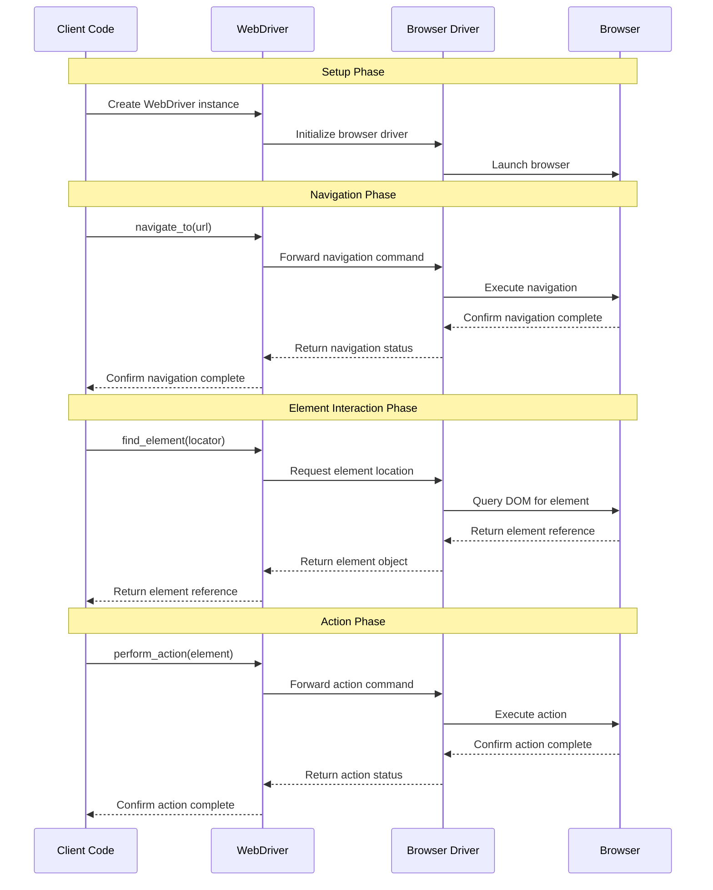

```mermaid
sequenceDiagram
    participant Client as Client Code
    participant WD as WebDriver
    participant BD as Browser Driver
    participant Browser
    
    Note over Client,Browser: Setup Phase
    Client->>WD: Create WebDriver instance
    WD->>BD: Initialize browser driver
    BD->>Browser: Launch browser
    
    Note over Client,Browser: Navigation Phase
    Client->>WD: navigate_to(url)
    WD->>BD: Forward navigation command
    BD->>Browser: Execute navigation
    Browser-->>BD: Confirm navigation complete
    BD-->>WD: Return navigation status
    WD-->>Client: Confirm navigation complete
    
    Note over Client,Browser: Element Interaction Phase
    Client->>WD: find_element(locator)
    WD->>BD: Request element location
    BD->>Browser: Query DOM for element
    Browser-->>BD: Return element reference
    BD-->>WD: Return element object
    WD-->>Client: Return element reference
    
    Note over Client,Browser: Action Phase
    Client->>WD: perform_action(element)
    WD->>BD: Forward action command
    BD->>Browser: Execute action
    Browser-->>BD: Confirm action complete
    BD-->>WD: Return action status
    WD-->>Client: Confirm action complete
```